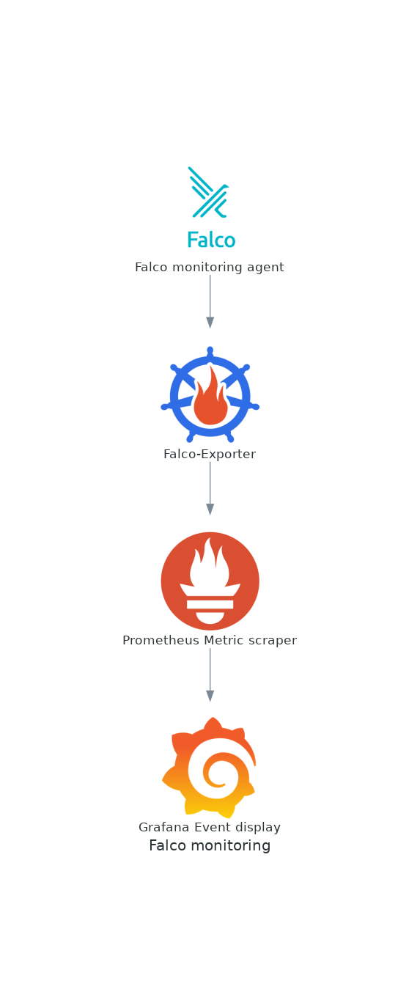

# Securing mixed clouds using Falco, Prometheus, Grafana and Docker

I was recently looking for a way to keep tabs on our containers and applications at work; specifically was interested on detecting anomalies in the configuration and after a little research, I stumbled on [Falco](https://github.com/falcosecurity/falco).

What I found was a very complete Open Source platform with lots of features and excellent documentation, so I tough on sharing my experience with you.

What will be covered in this article?

* How to install [Falco](https://falco.org/) agent on the host that you want to monitor for events (anomalies/ violations)
* How to tune Falco to reduce false positives and get the information you really need
* How to use [Prometheus](https://prometheus.io/) to collect Falco events into a central location, with the help of the exporters and a scrapper.
* Finally, how to connect the scrapper with [Grafana](https://grafana.com/) for visualization and alerting

## What do you need for this tutorial?

* A machine or machines with Linux installed. A virtual machine should work.
* You will need superuser permissions to be able to install/ setup Docker, RPM and systemd processes
* We will use Docker containers so basic knowledge of Docker is required
* Working knowledge of Python/ Bash, as we will write a few scripts to test and improve our configuration.

At the end you will be able to setup each one of the following components:



Don't be intimidated, links to documentation and explanation of each one of these tasks will be 
provided as we move along.

# What is Falco?

The best way to describe this tool *is to learn what it can do*:

> Falco can detect and alert on any behavior that involves making Linux system calls. Falco alerts can be triggered by the use of specific system calls, their arguments, and by properties of the calling process. For example, Falco can easily detect incidents including but not limited to:

> * A shell is running inside a container or pod in Kubernetes.
> * A container is running in privileged mode, or is mounting a sensitive path, such as /proc, from the host.
> * A server process is spawning a child process of an unexpected type.
> * Unexpected read of a sensitive file, such as /etc/shadow.
> * A non-device file is written to /dev.
> * A standard system binary, such as ls, is making an outbound network connection.
> * A privileged pod is started in a Kubernetes cluster.


# Installation

I will install Falco using an RPM ([similar instructions exist](https://falco.org/docs/getting-started/installation/) for apt-get, and even Docker containers). In my case I felt the native installation was the best, and the RPM made it very easy to do:

```shell=
[josevnz@macmini2 ~]$ sudo -i dnf install https://download.falco.org/packages/rpm/falco-0.31.1-x86_64.rpm
Last metadata expiration check: 2:53:53 ago on Sun 01 May 2022 04:13:09 PM EDT.
falco-0.31.1-x86_64.rpm                                                                                                                                                                                                       1.7 MB/s |  12 MB     00:07    
Dependencies resolved.
==============================================================================================================================================================================================================================================================
 Package                                                          Architecture                                      Version                                                                     Repository                                               Size
==============================================================================================================================================================================================================================================================
Installing:
 falco                                                            x86_64                                            0.31.1-1                                                                    @commandline                                             12 M
Installing dependencies:
 dkms                                                             noarch                                            2.8.1-4.20200214git5ca628c.fc30                                             updates                                                  78 k
 elfutils-libelf-devel                                            x86_64                                            0.179-2.fc30                                                                updates                                                  27 k
 kernel-devel                                                     x86_64                                            5.6.13-100.fc30                                                             updates                                                  14 M

Transaction Summary
==============================================================================================================================================================================================================================================================
Install  4 Packages

Total size: 26 M
Total download size: 14 M
Installed size: 92 M
Is this ok [y/N]: y
Downloading Packages:
(1/3): elfutils-libelf-devel-0.179-2.fc30.x86_64.rpm                                                                                                                                                                          253 kB/s |  27 kB     00:00    
(2/3): dkms-2.8.1-4.20200214git5ca628c.fc30.noarch.rpm                                                                                                                                                                        342 kB/s |  78 kB     00:00    
(3/3): kernel-devel-5.6.13-100.fc30.x86_64.rpm                                                                                                                                                                                1.9 MB/s |  14 MB     00:07    
--------------------------------------------------------------------------------------------------------------------------------------------------------------------------------------------------------------------------------------------------------------
Total                                                                                                                                                                                                                         1.8 MB/s |  14 MB     00:07     
Running transaction check
Transaction check succeeded.
Running transaction test
Transaction test succeeded.
Running transaction
  Preparing        :                                                                                                                                                                                                                                      1/1 
  Installing       : kernel-devel-5.6.13-100.fc30.x86_64                                                                                                                                                                                                  1/4 
  Running scriptlet: kernel-devel-5.6.13-100.fc30.x86_64                                                                                                                                                                                                  1/4 
  Installing       : elfutils-libelf-devel-0.179-2.fc30.x86_64                                                                                                                                                                                            2/4 
  Installing       : dkms-2.8.1-4.20200214git5ca628c.fc30.noarch                                                                                                                                                                                          3/4 
  Running scriptlet: dkms-2.8.1-4.20200214git5ca628c.fc30.noarch                                                                                                                                                                                          3/4 
  Running scriptlet: falco-0.31.1-1.x86_64                                                                                                                                                                                                                4/4 
  Installing       : falco-0.31.1-1.x86_64                                                                                                                                                                                                                4/4 
  Running scriptlet: falco-0.31.1-1.x86_64                                  
```

# Basic configuration

Unless we want to do very basic output processing, we want to enable the json output:

```yaml=
# Whether to output events in json or text
json_output: true
```

It will become evident why pretty soon.

Next [start](https://falco.org/docs/getting-started/running/) the falcon agent:

```shell=
[josevnz@macmini2 falco]$ sudo systemctl start falco.service 
[josevnz@macmini2 falco]$ sudo systemctl status falco.service 
● falco.service - Falco: Container Native Runtime Security
   Loaded: loaded (/usr/lib/systemd/system/falco.service; disabled; vendor preset: disabled)
   Active: active (running) since Sun 2022-05-01 19:20:52 EDT; 1s ago
     Docs: https://falco.org/docs/
  Process: 26887 ExecStartPre=/sbin/modprobe falco (code=exited, status=0/SUCCESS)
 Main PID: 26888 (falco)
    Tasks: 1 (limit: 2310)
   Memory: 65.8M
   CGroup: /system.slice/falco.service
           └─26888 /usr/bin/falco --pidfile=/var/run/falco.pid

May 01 19:20:52 macmini2 systemd[1]: Starting Falco: Container Native Runtime Security...
May 01 19:20:52 macmini2 systemd[1]: Started Falco: Container Native Runtime Security.
May 01 19:20:52 macmini2 falco[26888]: Falco version 0.31.1 (driver version b7eb0dd65226a8dc254d228c8d950d07bf3521d2)
May 01 19:20:52 macmini2 falco[26888]: Falco initialized with configuration file /etc/falco/falco.yaml
May 01 19:20:52 macmini2 falco[26888]: Loading rules from file /etc/falco/falco_rules.yaml:
May 01 19:20:53 macmini2 falco[26888]: Loading rules from file /etc/falco/falco_rules.local.yaml:
May 01 19:20:54 macmini2 falco[26888]: Loading rules from file /etc/falco/k8s_audit_rules.yaml:
```

# Testing default configuration

Depending on your [configuration](https://falco.org/docs/configuration/), you may or may not get any events right after starting falco:

```shell=
[josevnz@macmini2 falco]$ sudo journalctl --unit falco --follow
-- Logs begin at Tue 2021-05-25 00:15:22 EDT. --
May 01 19:20:52 macmini2 systemd[1]: Starting Falco: Container Native Runtime Security...
May 01 19:20:52 macmini2 systemd[1]: Started Falco: Container Native Runtime Security.
May 01 19:20:52 macmini2 falco[26888]: Falco version 0.31.1 (driver version b7eb0dd65226a8dc254d228c8d950d07bf3521d2)
May 01 19:20:52 macmini2 falco[26888]: Falco initialized with configuration file /etc/falco/falco.yaml
May 01 19:20:52 macmini2 falco[26888]: Loading rules from file /etc/falco/falco_rules.yaml:
May 01 19:20:53 macmini2 falco[26888]: Loading rules from file /etc/falco/falco_rules.local.yaml:
May 01 19:20:54 macmini2 falco[26888]: Loading rules from file /etc/falco/k8s_audit_rules.yaml:
May 01 19:20:55 macmini2 falco[26888]: Starting internal webserver, listening on port 8765
```

Worry not. We will run a few commands that will cause Falco to record some warning and alerts, time to see how this works!

## Running a privileged container 

It [is considered a bad practice](https://materials.rangeforce.com/tutorial/2020/06/25/Escaping-Docker-Privileged-Containers/), so let's see if this event is detected by Falco:

```shell=
[josevnz@macmini2 ~]$ docker run --rm --interactive --tty --privileged --volume /etc/shadow:/mnt/shadow fedora:latest ls -l /mnt/shadow
----------. 1 root root 1198 Nov 21 20:51 /mnt/shadow
```

And our Falco log?

```shell=
May 01 19:29:32 macmini2 falco[26888]: {"output":"19:29:32.918828894: Informational Privileged container started (user=root user_loginuid=0 command=container:bfb9637a47a6 kind_lumiere (id=bfb9637a47a6) image=fedora:latest)","priority":"Informational","rule":"Launch Privileged Container","source":"syscall","tags":["cis","container","mitre_lateral_movement","mitre_privilege_escalation"],"time":"2022-05-01T23:29:32.918828894Z", "output_fields": {"container.id":"bfb9637a47a6","container.image.repository":"fedora","container.image.tag":"latest","container.name":"kind_lumiere","evt.time":1651447772918828894,"proc.cmdline":"container:bfb9637a47a6","user.loginuid":0,"user.name":"root"}}
```

It shows up as an informational event. Definitely one of those things to keep an eye on. Ask yourself if the application on the container needs elevated privileges. You also probably noticed the following:

* Each message has tags. Pay attention to the "mitre_*" ones, they do relate to the [Mitre Attack knowledge base](https://attack.mitre.org/) of attacks and mitigations. Yep, you will spend some time reading those.

## Creating a file on the /root directory

This example shows how to abuse the root user combined with volumes in a container...

```shell=
[josevnz@macmini2 ~]$ docker run --rm --interactive --tty --user root --volume /root:/mnt/ fedora:latest touch /mnt/test_file
[josevnz@macmini2 ~]$ 
```

Falco reaction:

```shell=
May 01 19:32:02 macmini2 falco[26888]: {"output":"19:32:02.434286167: Informational Container with sensitive mount started (user=root user_loginuid=0 command=container:ef061174c7ef distracted_lalande (id=ef061174c7ef) image=fedora:latest mounts=/root:/mnt::true:rprivate)","priority":"Informational","rule":"Launch Sensitive Mount Container","source":"syscall","tags":["cis","container","mitre_lateral_movement"],"time":"2022-05-01T23:32:02.434286167Z", "output_fields": {"container.id":"ef061174c7ef","container.image.repository":"fedora","container.image.tag":"latest","container.mounts":"/root:/mnt::true:rprivate","container.name":"distracted_lalande","evt.time":1651447922434286167,"proc.cmdline":"container:ef061174c7ef","user.loginuid":0,"user.name":"root"}}
```

Sensitive mount detected!

## Let's raise the stakes by creating a file on /bin

```shell=
[josevnz@macmini2 ~]$ sudo -i
[root@macmini2 ~]# touch /bin/should_not_be_here
```

What Falco thinks about this?

```shell=
May 01 19:36:41 macmini2 falco[26888]: {"output":"19:36:41.237634398: Error File below a known binary directory opened for writing (user=root user_loginuid=1000 command=touch /bin/should_not_be_here file=/bin/should_not_be_here parent=bash pcmdline=bash gparent=sudo container_id=host image=<NA>)","priority":"Error","rule":"Write below binary dir","source":"syscall","tags":["filesystem","mitre_persistence"],"time":"2022-05-01T23:36:41.237634398Z", "output_fields": {"container.id":"host","container.image.repository":null,"evt.time":1651448201237634398,"fd.name":"/bin/should_not_be_here","proc.aname[2]":"sudo","proc.cmdline":"touch /bin/should_not_be_here","proc.pcmdline":"bash","proc.pname":"bash","user.loginuid":1000,"user.name":"root"}}
```

An error, binary directory opened for writing. Good catch.

# Defaults are not always good

After Falco is running for a while it is a good idea to get a sense of what kind of events we want to ignore and which ones we want to investigate. The first step is to get a list of all the events, using our JSON format on the payload:


```shell=
sudo journalctl --unit falco --no-page --output=cat > /tmp/falco_json_lines.txt
```

The 'output=cat' tells journalctl to give us the message payload without timestamps (do not worry, the JSON message itself has timestamps).

```shell
Starting Falco: Container Native Runtime Security...
Started Falco: Container Native Runtime Security.
Falco version 0.31.1 (driver version b7eb0dd65226a8dc254d228c8d950d07bf3521d2)
Falco initialized with configuration file /etc/falco/falco.yaml
Loading rules from file /etc/falco/falco_rules.yaml:
Loading rules from file /etc/falco/falco_rules.local.yaml:
Loading rules from file /etc/falco/k8s_audit_rules.yaml:
Starting internal webserver, listening on port 8765
{"output":"19:29:32.918828894: Informational Privileged container started (user=root user_loginuid=0 command=container:bfb9637a47a6 kind_lumiere (id=bfb9637a47a6) image=fedora:latest)","priority":"Informational","rule":"Launch Privileged Container","source":"syscall","tags":["cis","container","mitre_lateral_movement","mitre_privilege_escalation"],"time":"2022-05-01T23:29:32.918828894Z", "output_fields": {"container.id":"bfb9637a47a6","container.image.repository":"fedora","container.image.tag":"latest","container.name":"kind_lumiere","evt.time":1651447772918828894,"proc.cmdline":"container:bfb9637a47a6","user.loginuid":0,"user.name":"root"}}
{"output":"19:32:02.434286167: Informational Container with sensitive mount started (user=root user_loginuid=0 command=container:ef061174c7ef distracted_lalande (id=ef061174c7ef) image=fedora:latest mounts=/root:/mnt::true:rprivate)","priority":"Informational","rule":"Launch Sensitive Mount Container","source":"syscall","tags":["cis","container","mitre_lateral_movement"],"time":"2022-05-01T23:32:02.434286167Z", "output_fields": {"container.id":"ef061174c7ef","container.image.repository":"fedora","container.image.tag":"latest","container.mounts":"/root:/mnt::true:rprivate","container.name":"distracted_lalande","evt.time":1651447922434286167,"proc.cmdline":"container:ef061174c7ef","user.loginuid":0,"user.name":"root"}}
```

We need must normalize this data, we will use a python script that will:
* Remove non JSON data
* Aggregate event types without the timestamps
* Generate a few aggregation statistics, so we can focus on the most frequent events in our system

## A simple data normalizer in Python


# Falco integrations

You probably noticed 2 things from our earlier experimentation:

1. The payload of the events do not have the host; If you want to locate an offending server, you need to improve how a multi-host event is reported (parsing a journalctl file from many hosts is not practical).
2. We want to get alerts in a centralized location; it would be nice to have a way to "push" those events instead of us going to fish


Let's take a look how to integrate this with Grafana. For that will use the following:


## Falco exporter

The [Falco exporter](https://github.com/falcosecurity/falco-exporter) will allow us to share the falco alerts with Prometheus scrapper; We need first to enable [gRPC](https://grpc.io/) in the /etc/falco/falco.yaml

```yaml=
# gRPC server using an unix socket
grpc:
  enabled: true
  bind_address: "unix:///var/run/falco.sock"
  # when threadiness is 0, Falco automatically guesses it depending on the number of online cores
  threadiness: 0

# gRPC output service.
# By default it is off.
# By enabling this all the output events will be kept in memory until you read them with a gRPC client.
# Make sure to have a consumer for them or leave this disabled.
grpc_output:
  enabled: true

```

Restart Falco:

```shell=
[root@macmini2 ~]# systemctl restart falco.service 
[root@macmini2 ~]# systemctl status falco.service 
● falco.service - Falco: Container Native Runtime Security
   Loaded: loaded (/usr/lib/systemd/system/falco.service; disabled; vendor preset: disabled)
   Active: active (running) since Sun 2022-05-01 20:35:01 EDT; 26s ago
     Docs: https://falco.org/docs/
  Process: 28285 ExecStartPre=/sbin/modprobe falco (code=exited, status=0/SUCCESS)
 Main PID: 28288 (falco)
    Tasks: 11 (limit: 2310)
   Memory: 80.9M
   CGroup: /system.slice/falco.service
           └─28288 /usr/bin/falco --pidfile=/var/run/falco.pid

May 01 20:35:01 macmini2 systemd[1]: Starting Falco: Container Native Runtime Security...
May 01 20:35:01 macmini2 systemd[1]: Started Falco: Container Native Runtime Security.
May 01 20:35:01 macmini2 falco[28288]: Falco version 0.31.1 (driver version b7eb0dd65226a8dc254d228c8d950d07bf3521d2)
May 01 20:35:01 macmini2 falco[28288]: Falco initialized with configuration file /etc/falco/falco.yaml
May 01 20:35:01 macmini2 falco[28288]: Loading rules from file /etc/falco/falco_rules.yaml:
May 01 20:35:02 macmini2 falco[28288]: Loading rules from file /etc/falco/falco_rules.local.yaml:
May 01 20:35:03 macmini2 falco[28288]: Loading rules from file /etc/falco/k8s_audit_rules.yaml:
May 01 20:35:04 macmini2 falco[28288]: Starting internal webserver, listening on port 8765
May 01 20:35:04 macmini2 falco[28288]: gRPC server threadiness equals to 2
May 01 20:35:04 macmini2 falco[28288]: Starting gRPC server at unix:///var/run/falco.sock

```

Then we run the falco-exporter. To make it easier, we will use a Docker container [with a few overrides in the command line](https://docs.docker.com/engine/reference/commandline/run/).

```shell=
[root@macmini2 ~]# docker run --restart always --name falco-exporter --detach --volume /var/run/falco.sock:/var/run/falco.sock --network=host falcosecurity/falco-exporter --listen-address 192.168.1.16:9376
7d157af0251ea4bc73b8c355a74eaf4dd24a5348cbe3f5f2ea9d7147c6c366c8
[root@macmini2 ~]# docker logs falco-exporter
2022/05/02 00:56:30 connecting to gRPC server at unix:///var/run/falco.sock (timeout 2m0s)
2022/05/02 00:56:30 listening on http://192.168.1.16:9376/metrics
2022/05/02 00:56:30 connected to gRPC server, subscribing events stream
2022/05/02 00:56:30 ready

# Check with CURL if the URL is reachable
[root@macmini2 ~]# curl http://192.168.1.16:9376/metrics
# HELP go_gc_duration_seconds A summary of the pause duration of garbage collection cycles.
# TYPE go_gc_duration_seconds summary
go_gc_duration_seconds{quantile="0"} 0
go_gc_duration_seconds{quantile="0.25"} 0
go_gc_duration_seconds{quantile="0.5"} 0
go_gc_duration_seconds{quantile="0.75"} 0
go_gc_duration_seconds{quantile="1"} 0
go_gc_duration_seconds_sum 0
go_gc_duration_seconds_count 0
# HELP go_goroutines Number of goroutines that currently exist.
# TYPE go_goroutines gauge
go_goroutines 18
# HELP go_info Information about the Go environment.
# TYPE go_info gauge
go_info{version="go1.14.15"} 1
# HELP go_memstats_alloc_bytes Number of bytes allocated and still in use.
# TYPE go_memstats_alloc_bytes gauge
go_memstats_alloc_bytes 2.011112e+06
```

For completeness, let me show you also how to capture the host performance metrics [using the node exporter](https://prometheus.io/docs/guides/node-exporter/) (we will use it later to keep an eye on how many resources are used by Falco and to make sure our installation is not hurting the server):

```shell=
docker run --detach --net="host" --pid="host" --volume "/:/host:ro,rslave" quay.io/prometheus/node-exporter:latest --path.rootfs=/host
```

The node-exporter and the falco-exporter will rus on every host that needs their data scrapped, now you need wait to collect all these metrics into a single location, for that will use the [Prometheus agent](https://prometheus.io/docs/prometheus/latest/getting_started/):


```yaml=
---
# /etc/prometheus.yaml on raspberrypi
global:
    scrape_interval: 30s
    evaluation_interval: 30s
    scrape_timeout: 10s
    external_labels:
        monitor: 'nunez-family-monitor'

scrape_configs:
  - job_name: 'falco-exporter'
    static_configs:
      - targets: ['macmini2.home:9376']
  - job_name: 'node-exporter'
    static_configs:
      - targets: ['macmini2.home:9100', 'raspberrypi.home:9100', 'dmaf5:9100']
  - job_name: 'docker-exporter'
    static_configs:
      - targets: ['macmini2.home:9323', 'raspberrypi.home:9323', 'dmaf5:9323']

    tls_config:
      insecure_skip_verify: true
```

The make sure the Prometheus scrapper can talk with each one of the nodes. We visit the web UI:


Good, Prometheus is able to scrap Falco. We can even run a simple query to see a few events:


Next we need to setup the UI view for the events, for that we will use Grafana.

There are many ways to install it, in my case [I will use a Grafana Docker container](https://grafana.com/docs/grafana/latest/installation/docker/):

```shell=
docker run --detach --tty --volume /data/grafana:/var/lib/grafana -p 3000:3000 grafana/grafana:latest
```


Once Grafana is up, we can [import the Falco dashboard](https://grafana.com/grafana/dashboards/11914) as [explained here](https://grafana.com/docs/reference/export_import/). 


Once the dashboard is imported we can generate a few events to trigger Falco on the host where is installed:

```shell=
[root@macmini2 ~]# for i in $(seq 1 60); do docker run --rm --interactive --tty --privileged fedora:latest /bin/bash -c ls; touch /root/test; rm -f /root/test; sleep 1; done
```

After a little you should see something like this on your Grafana Dashboard:


The events are flowing, and you can see from which host they came from.

## So I have nice graphs about my events, now what?

Ideally if you have the events in Grafana, you can make these actionable items and generate alerts from then.

TODO

# Honorable mention: aggregating alerts using Falcon Sidekick/ Falcon Sidekick-UI

[Falco Sidekick](https://github.com/falcosecurity/falcosidekick) is another way to gather and send events to other destinations, like the [Falco Sidekick-UI](https://github.com/falcosecurity/falcosidekick-ui). But it has a very important missing feature: It won't tell you the originating host (At least until Falco 0.31.1).

This is most likely not an issue for an alert coming from a K8s cluster or a containerized application where the image name will give you plenty of information but if is your event happens on a bare-metal environment, and you have more than 2 machines it will become a headache. 

For that reason I won't cover Sidekick here, you may want to stick with the Grafana integration for the time being.

# Learning more

* Falco has a perfect interactive learning [environment](https://falco.org/docs/getting-started/third-party/learning/); You should try it to see what else is possible, there is a lot of things I did not cover here, like rule exceptions for example
